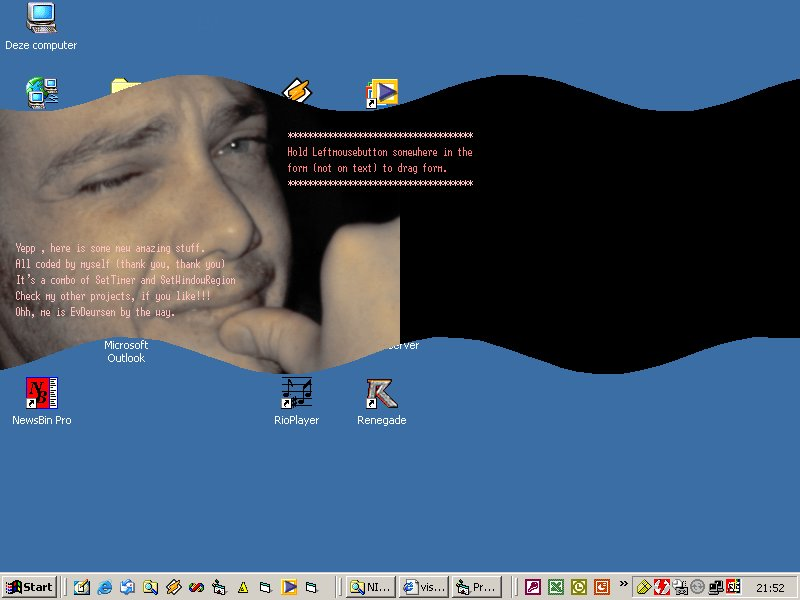



## SOME NICE API CODING \(NO CONTROLS\)

### Description

THE CODE TURNS A SIMPLE FORM IN A MOVING WAVE

NO CONTROLS, ONLY BY A FEW API's
 
### More Info
 

             |
---                |---
**Submitted On**   |2002-03-06 21:56:12
**By**             |[eelco van deursen](https://github.com/Planet-Source-Code/PSCIndex/blob/master/ByAuthor/eelco-van-deursen.md)
**Level**          |Intermediate
**User Rating**    |5.0 (45 globes from 9 users)
**Compatibility**  |VB 5\.0, VB 6\.0
**Category**       |[Windows API Call/ Explanation](https://github.com/Planet-Source-Code/PSCIndex/blob/master/ByCategory/windows-api-call-explanation__1-39.md)
**World**          |[Visual Basic](https://github.com/Planet-Source-Code/PSCIndex/blob/master/ByWorld/visual-basic.md)
**Archive File**   |[SOME\_NICE\_59874362002\.zip](https://github.com/Planet-Source-Code/eelco-van-deursen-some-nice-api-coding-no-controls__1-32411/archive/master.zip)

